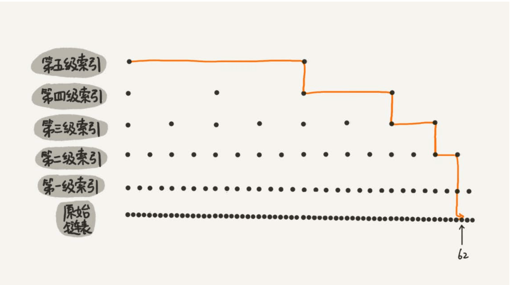

#### [1.Redis常见的数据结构有哪些？](#Redis常见的数据结构有哪些？)

#### [2.谈一谈你对Redis中简单动态字符串的理解？](#谈一谈你对Redis中简单动态字符串的理解？)

#### [3.谈一谈你对Redis中hash对象的理解？](#谈一谈你对Redis中hash对象的理解？)
#### [4.谈一谈你对Redis中List的理解？](#谈一谈你对Redis中List的理解？)
#### [5.谈一谈你对Redis中Set的理解？](#谈一谈你对Redis中Set的理解？)
#### [6.谈一谈你对Redis中有序集合ZSet的理解？](#谈一谈你对Redis中有序集合ZSet的理解？)

### Redis常见的数据结构有哪些？

Redis中主要的数据结构有字符串，Hash哈希表，List列表，Set集合，ZSet有序集合。
### 谈一谈你对Redis中简单动态字符串的理解？
Redis中的简单动态字符串其实是对C语言中的字符串的封装和优化，

##### 因为C语言的字符串有两个缺点：

1.不是二进制安全的（因为字符串以空字符作为结束的标志，字符串中间不能有空字符，Redis的简单动态字符串是一个结构体，有一个变量存储了字符串的长度，所以不需要以空字符作为结束的标志)。

从定义上来看，二进制安全是一种主要用于字符串操作函数相关的计算机编程术语。一个二进制安全功能（函数），其本质上将操作输入作为原始的、无任何特殊格式意义的数据流。对于每个字符都公平对待，不特殊处理某一个字符。

简单来说C语言使用\0字符来作为字符串结束符是不符合这种二进制安全的规范的。

2.频繁修改一个字符串时，会涉及到内存的重分配，比较消耗性能。（Redis中的简单动态字符串会有内存预分配和惰性空间释放）。

所以Redis中的简单动态字符串结构，除了包含一个字符数组的属性，还包含数组的长度，数组的实际使用长度等属性，通过增加长度属性，可以保证字符串是二进制安全的，从而可以保存任意类型的数据，例如一张图片，对象序列化后的数据等等。

##### 字符串使用场景如下：

1.字符串可以保存一些字符串数据，也可以保存一些数字类型的数据，所以可以使用INCR, DECR, INCRBY对数字进行加减，所以可以把字符串当成计数器使用。

2.同时因为在C语言中，每个字符是一个字节，是8个二进制位，所以可以把简单动态字符串作为一个位数组来使用，通过setbit，getbit命令来对位数组进行赋值，取值，可以以很小的空间来保存用户一年的每日签到数据，以及Redis中的布隆过滤器也是通过位数组来实现的。

##### 字符串的底层存储

在Redis中，每一个Value都是一个Redis对象，对应的都是RedisObject结构，在RedisObject结构中，保存了对象的类型type，底层的编码encoding等一些属性，也拥有一个ptr指针，指向对象具体的存储地址。
```
struct RedisObject {
    int4 type; //类型
    int4 encoding; //编码
    int24 lru; 
    int32 refcount; 
    void *ptr; 
} robj;
```
在Redis中，字符串有两种存储方式，int编码，embstr编码和raw编码。
##### int编码

当value是一个整数，并且可以使用long类型（8字节）来表示时，那么会属于int编码，ptr直接存储数值。（并且Redis会进行优化，启动时创建0~9999的字符串对象作为共享变量。）
##### embstr和raw编码
两种存储方式下，都RedisObject和SDS结构(简单动态字符串)来存储字符串，区别在于，embstr对象用于存储较短的字符串，embstr编码中RedisObject结构与ptr指向的SDS结构在内存中是连续的，内存分配次数和内存释放次数均是一次，而raw编码会分别调用两次内存分配函数来分别创建RedisObject结构和SDS结构。

### 谈一谈你对Redis中hash对象的理解？
在Redis中，value可以是一个hash表，底层编码可以是ziplist，也可以是hashtable（默认情况下，当元素小于512个时，底层使用ziplist存储数据）
#### ziplist

元素保存的字符串长度较短且元素个数较少时(小于64字节，个数小于512)，出于节约内存的考虑，hash表会使用ziplist作为的底层实现，ziplist是一块连续的内存，里面每一个节点保存了对应的key和value，然后每个节点很紧凑地存储在一起，优点是没有冗余空间，缺点插入新元素需要调用realloc扩展内存。（可能会进行内存重分配，将内容拷贝过去，也可能在原有地址上扩展）。

#### hashtable
元素比较多时就会使用hashtable编码来作为底层实现，这个时候RedisObject的ptr指针会指向一个dict结构，dict结构中的ht数组保存了ht[0]和ht[1]两个元素，通常使用ht[0]保存键值对，ht[1]只在渐进式rehash时使用。hashtable是通过链地址法来解决冲突的，table数组存储的是链表的头结点（添加新元素，首先根据键计算出hash值，然后与数组长度取模之后得到数组下标，将元素添加到数组下标对应的链表中去）。
```
struct dict {
    int rehashindex;
    dictht ht[2]; 
}
struct dictht {
    dictEntry** table; // 二维
    long size; // 第一维数组的长度 
    long used; // hash 表中的元素个数 ...
}
typedef struct dictEntry {
  //键  
  void *key;
  //值，可以是一个指针，也可以是一个uint64_t整数，也可以是int64_t的整数
  union {
    void *val;
    uint64_tu64;
    int64_ts64;
  } v；
  //指向下一个节点的指针
  struct dictEntry *next;
} dictEntry；
```

#### 渐进式rehash

进行当负载因子>=1时，会进行哈希表扩展操作（如果是在执行BGSAVE或BGREWRITEAOF命令期间，那么需要>=5才会进行扩展）。

进行当负载因子<0.1时，会进行哈希表收缩操作。

因为直接一次性完成rehash会对性能产生影响，所以可以渐进式rehash，具体执行步骤是:

##### 初始化
1.首先将对dict结构中ht[1]哈希表分配空间(大小取决于最接近实际使用空间的2的n次方幂)，然后将rehashindex属性设置为0。

##### 转移
2.这种渐进式rehash转移元素不是全部转移，如果在rehash时全部转移，可能会导致rehash期间Redis实例无法处理后面的请求，所以采取的策略是每次用到某个下标下的键值对才进行转移这个下标下所有的键值对。然后每次对ht[0]中的元素查找，修改，添加时，除了执行指定操作外，还会将对应下标的所有键值对rehash到ht[1],并且会将rehashindex+1。

##### 更改指针指向
3.当ht[0]中所有键值对都是rehash到ht[1]中后，那么会ht[1]和ht[0]的指针值进行交换，将rehashindex设置为-1，代表rehash完成。
（整个rehash期间，查找，更新，删除会先去ht[0]中执行，没有才会到ht[1]中执行，新添加键值对是会被保存到ht[1]中）。

### 谈一谈你对Redis中List的理解？

在Redis中，存储的value可以是一个列表List，跟Java中的LinkedList很像，底层数据结构是一个链表，插入和删除很快，随机访问较慢，时间复杂度是O(N)。Java中的列表数据进行缓存时一般是序列化成JSON，以字符串的形式存储在Redis上，而不是使用Redis中的List来进行存储。Redis中的List可以作为一个队列来使用，也可以作为一个栈来使用。在实际使用中，常用来做异步队列使用，将可以延时处理的任务序列化成字符串塞进Redis的列表，另外一个线程从列表中轮询数据进行处理
#### quicklist

老版本中的Redis，元素较少时，使用ziplist来作为底层编码，元素较多时使用双向链表linkedList作为底层编码。因为链表每个节点需要prev，next指针，需要占用16字节，而且每个节点内存都是单独分配，加剧内存碎片化，所以新版本使用quiklist作为底层编码，quicklist的是一个双向链表，但是它的每一个节点是一个ziplist。（默认每个ziplist最大长度为8k字节）

### 谈一谈你对Redis中Set的理解？
Set是一个无序的，不重复的字符串集合，底层编码有inset和hashtable两种。

##### inset

当元素都为整数，且元素个数较少时会使用inset作为底层编码，inset结构中的有一个contents属性，content是是一个整数数组，从小到大保存了所有元素。

##### hashtable

当元素个数较多时，Set使用hashtable来保存元素，元素的值作为key，value都是NULL。

### 谈一谈你对Redis中有序集合ZSet的理解？
Zset与Set的区别在于每一个元素都有一个Score属性，并且存储时会将元素按照Score从低到高排列。底层是通过跳跃表实现的。

##### ziplist

当元素较少时，ZSet的底层编码使用ziplist实现，所有元素按照Score从低到高排序。

##### skiplist+dict

当元素较多时，使用skiplist+dict来实现，
skiplist存储元素的值和Score，并且将所有元素按照分值有序排列。便于以O(logN)的时间复杂度插入，删除，更新，及根据Score进行范围性查找。

dict存储元素的值和Score的映射关系，便于以O(1)的时间复杂度查找元素对应的分值。

### 布隆过滤器是什么？
布隆过滤器可以理解为一个有误差的set结构，使用布隆过滤器来判断元素是否存在其中时，

如果返回结果是存在，实际可能存在也可能不存在，

返回结果不存在时，实际结果肯定是不存在。

布隆过滤器实际上是一个大型的位数组，添加key时，通过几个hash函数对key计算得到多个hash值，将每个hash值与布隆过滤器的位数组的size取模得到下标，然后将数组中这些下标位置的值都设置为1。

创建key为userid的布隆过滤器，0.01是误判率，10000是初始大小

```
127.0.0.1:6379> bf.reserve userid 0.01 100000
```

调用exist指令判断181920是否存在于布隆过滤器，如果返回0，不存在，那么说明一定不存在，如果返回1，代表可能存在，也可能不存在。

```
127.0.0.1:6379> bf.add userid '181920'
(integer) 1
```

参考链接：

https://blog.csdn.net/lifetragedy/article/details/103945885

### 谈一谈你对跳跃表的理解？

就是单链表的查找的时间复杂度为O(N)，为了提高查询效率，可增加一些索引节点，让查询时间复杂度降低为O(logN)。（只有底层单链表会保存节点数据，上层的节点之后保存几个索引项和分数，也就是向左指向前一个节点的索引，向右指向后一个节点的索引，向下指向上一级的索引。）

时间复杂度的推理过程可以认为，从每一级索引中两个节点中选一个节点作为下一级索引的节点，让下一级索引的节点数量为本级索引节点数量的一半。假设原始链表的长度为n，第一级索引节点个数为n/2,第二级为n/4，一直到最高层。
```
假设h为层数，f(h)为该层索引节点数量。
f(h)=n/(2^h)
而最高层的索引节点会是只有两个索引节点。
也就是f(maxH)=n/(2^maxH)=2，所以最大层数maxH= log(n) - 1层 ，加上单链表的层数，总层数也就是log(n)层。
例如我们的单链表是1-19的，建立的多层索引如下，
如果我们要查找19，一开始在第四层遍历1，发现19>1,向右走，发现19>9,那么需要到上一级索引去找，然后发现19>13，继续到下一层，一直到第一层，发现19>17，然后往右走遍历17，18，19
所以每一层遍历的节点其实是
1 9
9 13
13 15 17
17 18 19
所以每一层最多遍历的节点数是<=3,这是由于每一层索引节点数是上一层的节点数的一半来得到的，每两个节点的区间，在上一层中都是两个区间，就是第三层的 1  5区间对应上一层的1  3 区间和3  5 区间。
所以时间复杂度=总层数*每层遍历节点数=3logN,去掉常数后是log(N)

第四层 1               9 
第三层 1       5       9          13
第二层 1   3   5   7   9    11    13    15    17
第一层 1 2 3 4 5 6 7 8 9 10 11 12 13 14 15 16 17 18 19
```




但是这种全索引的结构有缺点，就是之后在插入新节点时，是没有办法为新节点添加一些新的索引节点的。所以有可能会导致一个小区间内有很多个节点，查找时近似于单链表，这样时间复杂度就变成O(N)了，所以Redis对跳跃表做了一些优化，可以简单认为会计算出一个随机数，代表这个添加添加的索引层数，然后进行添加。同时假设节点拥有k层索引的概率f(k)，节点拥有k-1层索引结构的概率为f(k-1)，f(k) = f(k-1)*P,假设p为1/2，那么也就是f(k)=f(k-1)\*0.5，那么第k层的索引节点数也就是为k-1层的0.5倍。最终索引结构跟上面的这种全索引结构是类似的，只是索引节点不一定分布均匀。空间复杂度=每一层索引节点数=n+n/2+n/4….=2n。Redis做了优化，发现P取1/4时，时间复杂度跟P取1/2是一样的，并且空间复杂度更低。

```java
//ZSKIPLIST_P代表获取下一层的概率，是0.25  
//ZSKIPLIST_MAXLEVEL代表是最大层数，是32层
int zslRandomLevel(void) {
    int level = 1;
    while ((random()&0xFFFF) < (ZSKIPLIST_P * 0xFFFF))
        level += 1;
    return (level<ZSKIPLIST_MAXLEVEL) ? level : ZSKIPLIST_MAXLEVEL;
}
```

Redis计算总层数的算法大致是，初始层数是1层，在while循环内，取一个随机数，

有1/4的概率，层数+1。

有3/4的概率，层数不变，结束循环。

要原因是因为作为一种动态的数据结构，其删除和添加的节点是不可预测的，而跳跃表又不能像平衡二叉树那样，可以通过染色或者旋转来维持平衡，如果严格按照两个节点之间建立一个索引，在删除和添加节点时，需要更新的索引太多了。所以在这种情况下，就需要一种概率随机化的方式来自动均衡跳跃表的多级索引，通过这种方式虽然不能完全保证跳跃表的均匀性，但总体上可以使得跳跃表趋于平衡，从而能够达到较高的综合性能。

新插入了很多节点后带来的问题：


时间复杂度与空间复杂度

空间复杂度的公式是 空间复杂度= 1/(1-P)


### 跳跃表与平衡树，哈希表的比较？

1.单key查找时，跳跃表和平衡树的时间复杂度为O(log(N))，哈希表的时间复杂度为O(1)。

2.范围查找时，跳跃表和平衡树可以Log(N)的复杂度进行范围查找，但是平衡树在找到指定范围的左区间后，还需要进行中序遍历以找到不超过右区间的节点，相对来说，实现会复杂一些。

3.在删除和插入节点后，平衡树需要进行左旋，右旋，进行调整保证平衡性。而跳跃表只需要修改相邻节点的指针，然后计算这个新增节点的层数，每一层指向相应的节点。

4.从内存占用上来说，skiplist比平衡树更灵活一些。一般来说，平衡树每个节点包含2个指针（分别指向左右子树），而skiplist每个节点包含的指针数目平均为1/(1-p)，具体取决于参数p的大小。如果像Redis里的实现一样，取p=1/4，那么平均每个节点包含1.33个指针，比平衡树更有优势。

参考链接：

https://www.cnblogs.com/Elliott-Su-Faith-change-our-life/p/7545940.html

### 为什么MySQL不使用跳跃表作为索引？

首先MySQL的业务场景对应的数据量都是几千万数量级的，数据是不可能全部加载到内存中的，只能是部分数据加载到内存中。而Redis是个基于内存的数据库，数据是可以全部加入到内存中的。

磁盘IO的开销

对机械磁盘进行一次IO读取操作开销是非常大的，磁盘读取的速度大致是内存读取速度的几百分之一。所以操作系统做了一些优化，进行一次磁盘IO操作时，会进行一些预读，不仅是将当前磁盘地址的数据读取到内存中，而是把相邻数据也读取到内存缓存区。(因为局部性预读原理告诉我们，当计算机访问一个地址的数据的时候，与其相邻的数据也会很快被访问到。每一次IO读取的数据我们称之为一页(page)。具体一页有多大数据跟操作系统有关，一般为4k或8k，innodb中一页是16K。)

而一般innodb的B+树一般是2到4层，也就是最多进行2到4次磁盘IO，就可以查找到对应值所在的叶子节点，然后进行操作。而如果是跳跃表，查找一个Score对应的位置是需要进行Log(N)次的操作，如果跳跃表的索引节点都存在磁盘中，那么也就需要Log(N)次的磁盘IO。

### 为什么平衡二叉树也不适合作为索引？

之前说了平衡树的查找时间复杂度是O(log2N)，已经很不错了，但还是不适合作为索引结构。主要是因为索引通常是很大的，因此无法一次将全部索引加载到内存当中，因此每次只能从磁盘中读取一个磁盘页的数据到内存中。而这个磁盘的读取的速度较内存中的读取速度而言是差了好几个级别。我们说的平衡二叉树结构，指的是逻辑结构上的平衡二叉树，其物理实现是数组。然后由于在逻辑结构上相近的节点在物理结构上可能会差很远。因此，每次读取的磁盘页的数据中有许多是用不上的。因此，查找过程中要进行许多次的磁盘读取操作。

而适合作为索引的结构应该是尽可能少的执行磁盘IO操作，因为执行磁盘IO操作非常的耗时。因此，平衡二叉树并不适合作为索引结构。

https://www.cnblogs.com/aspirant/p/9214485.html

### 跳跃表是怎么执行查询操作的？

Zset是基于跳跃表+字典实现的，如果只是单key查询，那么就直接从字典中查询(字典的key就是保存了元素的值，value则是元素的分值score)，这样可以用O(1)的时间复杂度完成查询。如果是根据分值score进行范围查询，就是去跳跃表中查询

跳跃表的查询

跳跃表中查找元素只需要通过节点的前进指针完成。

因为每个节点有多层前进指针，首先取第一个节点的最上层的前进指针level[i]，比较指针level[i]跳转到的节点的score与查找的score的大小

如果大于，那么说明要查找的score就处于当前节点与当前的level[i]跳转的节点**之间**，不能跳转，直接下降一级，取level[i-1]的指针进行判断。如果level[i-1]是最下面的一层，也就是单链表的指针，那么就直接向后进行遍历查找，直到找到这个score或者第一个大于这个score的值(也就是范围查找的左边界)。

如果小于，说明说明要查找的score就处于当前节点与当前的level[i]跳转的节点的**后面**，跳转后，取跳转后的节点进行这个判断。

https://www.cnblogs.com/kexinxin/p/11699230.html

https://blog.csdn.net/L597692583/article/details/53305044