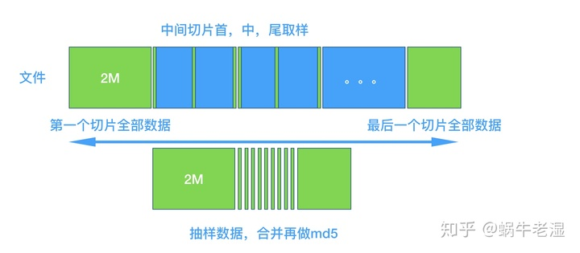
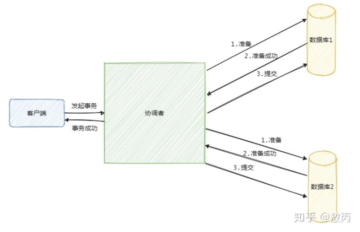
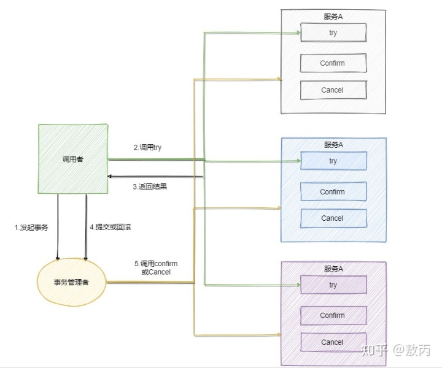

(PS：扫描[首页里面的二维码](README.md)进群，分享我自己在看的技术资料给大家，希望和大家一起学习进步！)

#### [1.怎么设计一个大文件上传的功能？](#怎么设计一个大文件上传的功能？)

#### [2.谈一谈ID生成方案的了解？](#谈一谈ID生成方案的了解？)

### 怎么设计一个大文件上传的功能？

首先如果是大文件上传，考虑到网络不稳定容易造成上传失败，或者需要做断点续传功能，是不是对整个文件直接进行上传的。
#### 1.计算hash

首先是让前端对大文件计算hash值，主要是用于后端去判断这个文件在服务器上是否已经存在，其次是这个hash值可以作为上传文件的一个标识。
如果是直接对整个文件计算hash值，文件过大时，可能会比较慢，通常是对文件进行抽样计算。根据hash值判断文件是否在后端已经存在，已存在就不进行上传了。

##### 影分身Hash
就是把文件切分成2M的分片，然后对首文件+中间每个文件的首中尾取2个字节+尾文件，进行合并，计算合并文件的MD5值，作为文件的hash值。

如果这个hash值在后端存在：
说明这个文件可能存在也可能不存在。准确性不是100%。

如果这个hash值在后端不存在：
说明这个文件一定不存在。准确性是100%。

通过这种方式判断的思路跟布隆过滤器比较像。

#### 2.分片上传

上传时不能一窝蜂地把所有分片文件发给后端，是把每个分片包装成一个网络请求，使用异步线程对从队列里面每次取一个分片进行上传。
每个分片文件都有一个唯一标识，就是hash值+分片编号。这样如果上传中断了，下次再进行上传时，后端可以知道哪些分片已经上传，把未上传的分片唯一标识返回给前端，前端只需要上传上次未上传的分片，这也就是断点续传。

https://zhuanlan.zhihu.com/p/104826733

#### 3.合并请求
有两种方案，一种是后端记录所有分片的上传状态，当所有分片全部上传完毕后，自动合并文件。另外一种就是前端发现传完所有文件后，调用接口通知后端去合并。

### 谈一谈ID生成方案的了解？
首先ID生成方案的技术考虑点：
唯一性：不能重复。
趋势递增：保证id作为主键时，插入数据库时的顺序性，避免随机插入。
单调递增：满足某些特殊业务的要求，保证后一秒请求生成的id比前一秒的大。
信息安全性：不要像UUID一样泄露mac地址，也不要像数据库主键ID自增完全连续，泄露每日id生成数据量。

#### 1.UUID模式

太长，占用存储空间过大
id是字符串类型，查询成本高于数字类型
如果是包含mac地址的UUID会泄密

#### 2.单机数据库主键自增模式

id生成的量受限于单机MySQL数据库的性能
强依赖于数据库，主从切换时容易导致重复发号
容易泄露id生成量

#### 3.多机数据库主键自增模式

主要是将每个数据库的步长设置为一样，但是起始值不一样，以此错开生成的id，不便于扩展。

##### 4.Leaf号段模式模式

就是数据库存储一个maxId代表已经发放的id最大值，每次将maxId更新为max+step，取step数量的id发放。
优点：
1.便于扩展，发号性能取决于step，可以动态调整。(Leaf做了Step动态调整策略，一个号段使用时间<15分钟，就让号段拥有的id量step翻倍(直到最大阀值100万)，一个号段使用时间>30分钟,step减半(直到最低阀值，初始号段id量)。)
2.即便主节点的宕机，短时间Leaf也能继续提供服务，其次是主从切换时影响较小。
缺点：
1.当号段里面的id用完时，会去数据库取新的号段，此时如果来了获取id的请求会需要进行等待。(Leaf做了双Buffer优化，使用了双Buffer各存储一个号段，当一个号段使用量达到10%后，就触发另一个号段去数据库取新号段进行更新，以便于当一个号段使用完时，可以直接切换到未使用的号段。)
2.id是连续的，容易泄密。(可以自定义抛弃策略，取号段时的时候抛弃一些id，或者定时抛弃掉一些id。)

#### 5.Leaf-snowflake模式

就是沿用了snowflake原本的位数分配算法，1标志位+41位毫秒时间戳+10位机器位+12位序列号。使用zookeeper作为注册中心，id生成服务启动时，去指路径下获取所有节点的列表，判断当前ip+port是否有对应的workid存在，有就使用，没有就往插入一个新的永久顺序节点，序号则为workId(并且会将workid缓存到本地磁盘上)。运行期间每过3s，都会上报最新的时间戳到zookeeper。
**时钟回滚的处理：**
**启动时：**
zookeeper里面会存上次生成id的时间戳，如果上次存储的时间戳>当前系统时间戳，那么就抛出异常，启动失败。
**运行时：**
如果获取id时，发现上次生成id时的时间戳>当前系统时间戳，那么说明运行时发生了时钟回滚，如果回滚的时间差<5ms，就调用wait()方法等待10ms，然后再获取id，时间差>5ms，就抛出异常。

优点：

**时钟回滚优化**

1.对时钟回滚做了特殊处理。

**zookeeper弱依赖**

2.为了减轻了zookeeper的弱依赖，实现在zookeeper挂了的情况下，id生成服务也能启动，每次启动后，在本地也缓存workid配置，一旦启动时，发现zookeeper连接不上，就通过从本地缓存配置中读取workid。(但是这样也有问题，本地缓存配置只存了workid，没有存上次生成id的最大时间戳，所以一旦启动前发生了时钟回滚，或者是修改了系统时间，这样从本地缓存配置中读取workid生成的id就可能是重复的。)

**时间差优化**

3.做了时间差优化，就是默认的时间戳是从1970年开始的，leaf是自己选定了2010年的一个时间点，以此来计算时间戳，这样可以在时间位数固定的情况下，增长服务最大运行时间。在毫秒时间戳为41位的情况下，时间差最大是69年，如果以1970年为起点，那么最大时间就是1970+69年，如果以2010年为起点就是2010+69年。

**序列号优化**

4.为了防止生成的id的序列号部分都是从0开始，导致插入数据库时，有数据倾斜的问题，所以每次用新的毫秒时间戳时，序列号不是从0开始，而是计算一个0到100之间的随机数作为起点。

缺点：

1.注册中心只支持Zookeeper

2.潜在的时钟回拨问题

3.时间差过大时，生成id为负数。

### 6.百度的uid-generator模式

#### 默认模式

每次启动时向数据库插入一条数据，这行数据的主键是自增的，主键id就是workId，

因为默认是snowflake算法是**1标志位+41位时间戳+10位机器号+12位序列号**，

因为百度的是每次启动都获取新的机器号，所以它修改了这些位数配比，是

**1标志位+28位的秒级时间差+22位的机器号+13位的序列号**，所以总共支出2的22次方次启动，也就是400万次启动。最大服务支持时间是2*28次方，也就是8.7年。（优化点是修改位数分配，让服务时间更长，我们的位数分配是**30位秒级时间差+16位机器号+7位序列号**，最长服务时间支持34年，6.5w次机器启动，每个机器每秒128个并发，总共位数没有用到64位，只用到53位，这样生成的id转化为10进制更小。）

解决时间回拨问题：

* 启动时时间回拨

因为是每次都用新的机器号，所以当前机器号都是之前没有的，所以即便时间戳回拨也不影响。

* 运行时时间回拨

会使用lastSecond来记录上次生成id的时间戳，如果当前时间戳比lastSecond还小，就抛出异常。（优化点就是**回拨时间差较小时进行等待**，较长时再抛出异常。）

缺点：

1.默认的最大服务年限太短，只有8年。

2.回拨时间差较小时也是抛出异常，没有额外的判断逻辑。

3.没有像Leaf一样做序列号优化，可能生成的id序列号部分都是从0开始的多一些，可能会存在数据倾斜的问题。

#### 缓存模式

主要继承自默认模式，只是用一个环形数组来存储生成好的id，每次去环形数组中去，默认大小是2的13次方，8192。这种模式使用的时间取得不是实时的系统时间，而且使用启动时的时间，每次生成一组id时，对之前保存的时间+1。

**阀值检测预填充**：取id时，发现可用id数小于阀值50%时，就对后面已经使用的id进行再填充。

**定期填充**：每5分钟定期会去检查环形数组中id使用情况，然后生成一组最大序列号个数的id(默认是8192个)，然后进行填充，多的直接丢弃掉。

**缺点**：

1.id只有在定期填充时，会丢弃掉一些id，其他情况下，id是完全连续的。假如每次使用量比较大，大部分时候都是5分钟内能用掉50%的话，那么就就不会触发定期填充，也没有id丢弃，导致id会一直连续，容易泄露数据信息，所以最好自定义丢弃逻辑。

2.其次是id跟生成id时系统的时间戳无关了，可能无法满足一些特殊业务的需求。

### 自己的方案

我们自己的主要是根据uid-generator来做的，因为只是启动的时候依赖数据库，不需要引进新的依赖。做的优化主要是修改了位数分配，使得支持最大服务年限更长，30位时间差+16位机器号+7位序列号。做了时钟回拨优化，回拨差值较小时进行等待。以及做了序列号丢弃的优化。

### 谈一谈你对分布式事务的理解？

#### 2PC方案(2阶段提交制)

这种方案就是引入了一个协调者，主要分为prepare和commit两个阶段，在第一阶段其实就是协调者给各个业务系统发送命令，业务系统收到后，就会开始执行这个子事务的具体操作，然后给协调者反馈，子事务执行成功还是失败，发送后，业务系统就会同步阻塞等待协调者的第二阶段的指令。

协调者第一阶段发送指令会进入超时等待状态，等待各个业务系统返回子事务的执行结果。

**执行成功，提交**

如果所有业务系统都执行成功了，并且协调者收到了反馈，那么就认为整个事务执行成功了，就会通知各个业务系统进行提交。

**执行失败，回滚**
如果超过时间还没有收到所有业务系统返回的结果，或者是有业务系统返回了执行失败的结果，那么协调者就认为执行失败了，通知各个业务系统进行回滚，如果此时网络出现阻塞，业务系统收不到通知，那么协调者就会一直重试发送回滚的指令。

缺点就是如果第二阶段网络发生了阻塞，协调者与业务系统断开了连接，协调者就只能一直去进行重试，发生回滚指令给业务系统，而业务系统会一直阻塞等待第二阶段的通知。

其次是2PC 适用于**数据库层面的分布式事务场景**，如果事务中有上传一张图片或者发送一条短信，这些是没有相应的回滚操作的。

#### TCC

2PC是基于数据库层面的分布式事务场景，而TCC是针对所有业务场景的，TCC分为Try预留阶段，Confirm确认阶段，Cancel撤销阶段三个阶段。

比如某个事务需要A，B，C三个业务系统各自执行一些操作，那么事务管理器会发送Try指令，会让A，B，C三个业务系统各自去申请执行操作所需的一些资源，冻结库存之类的。A，B，C预留资源成功了就会通知事务管理器Try阶段执行成功了。那么事务管理器就会发送Confirm指令给三个业务系统，告诉他们进入到Confirm阶段，让A，B，C业务系统各自执行自己真正的事务操作。如果三个业务系统都执行成功，那么事务管理器就认为执行成功，如果有一个失败那么事务管理器就认为执行失败了，会通知每个业务执行Cancel操作，进行回滚。

（万一某个服务的 Cancel 或者 Confirm 逻辑执行一直失败怎么办呢？

 Cancel 或者 Confirm 一直没成功，会不停的重试调用它的 Cancel 或者 Confirm 逻辑，务必要它成功。）

TCC框架主要有ByteTCC，TCC-transaction，Himly。

缺点：

1.侵入性太强，每个业务系统还需要写Cancel对应的数据回滚相关的逻辑代码。

https://www.cnblogs.com/jajian/p/10014145.html

##### 本地消息表法

就是上游服务先执行操作，将操作记录到数据库中的本地消息表，并且此时这条操作记录的status设置为0，也就是未通知成功。然后将操作记录封装成Kafka消息发送到消息队列，下游系统接受到，进行消费，然后消费成功后调用上游服务的接口，通知他消费成功了，上游系统将本地消息表中这条记录的status设置为1，代表通知成功。

并且上游系统会定时扫描本地消息表，将status为0的操作记录，封装成Kafka消息，发送到消息队列。

并且下游系统是通过消息中操作记录的主键id来防止不重复消费，保证幂等性的。就是消费消息时，发送操作记录的id已经在数据库中存在了，就代表之前已经处理过了，不处理这条消息了。

### 如何设计秒杀系统？

1.前端页面
提前把静态资源部署到CDN，减少静态资源访问的压力，其次是可以为静态资源的header设置成强缓存cache-control，2分钟后才过期，这样当第一次请求完静态资源后，再次刷新时，就会使用浏览器里面的缓存的静态资源，而不是再发请求。
2.nginx层面
使用limit_req_zone模块针对用户id为key，进行限流，放在同一个用户恶意发起多个请求，限制每个用户每5分钟只能请求100次接口。
3.业务系统设置限流熔断
当业务系统收到的请求达到一定限制后，停止接受请求，可以使用hystrix进行限流。如果是秒杀商品，当Redis里面存的商品库存减完时，就对所有用户返回统一的状态码，告诉前端商品被抢光了，不再进行后面的业务逻辑。
4.使用消息队列削峰
就是如果秒杀请求对应的业务逻辑处理时间如果过长，例如减库存，生成订单等，业务系统可以先将用户的秒杀请求封装成Kafka消息，发送到消息队列，由其他业务系统消费Kafka消息，完成生成订单等耗时操作。
https://www.zhihu.com/question/54895548/answer/1352510403